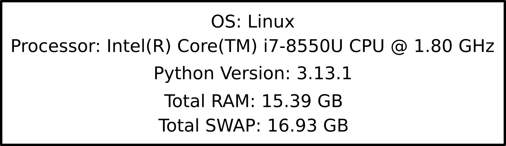
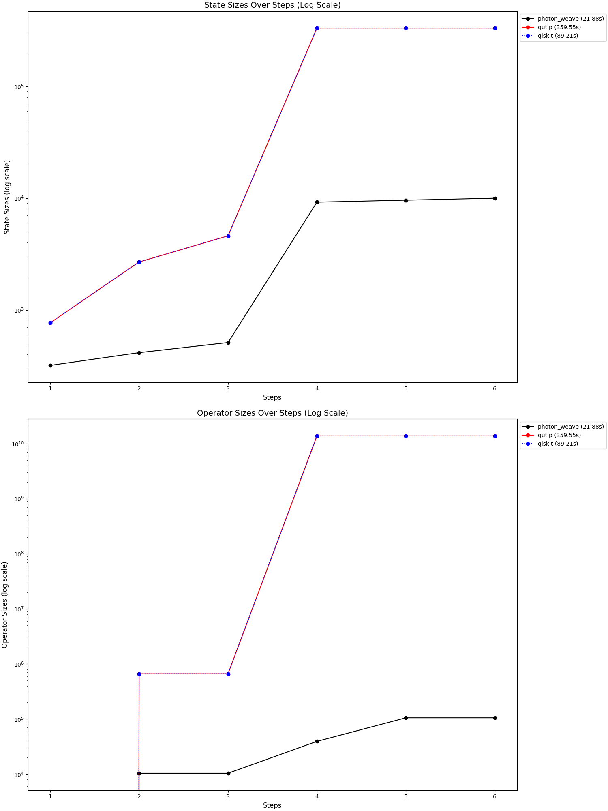

# Benchmarks

All of the benchmarks were carried out on the ThinkPad X1 Carbon 6th Gen:

## Lossy Beam Splitter Circuit
In this benchmark, we test a circuit containing five lossy beam splitters. After each beam splitter operates on a state, one photon is absorbed in both modes. This setup serves as an exercise in managing large product spaces, demonstrating dimension adjustments, operator construction without padding, and applying operators directly to the relevant subspace. We measure execution time and track the sizes of states and operators at each step.

### Results

### Comments

- **Memory Efficiency**: Photon Weave's dimension-adjustment feature leads to lower memory consumption  for states, a capability not currently available in Qiskit or QuTiP.
- **Operator Construction**: In Photon Weave, operators are applied directly to the relevant subspace without padding, further reducing operator size. This, combined with lower dimensionality, significantly decreases memory usage.
- **Execution Speed**: These features, along with JAX's JIT functionality, translates into substantially faster execution times in this benchmark.

### Bottleneck & Constraints
Operator construction remains a bottleneck because operators are represented as large square matrices. This limitation restricts the benchmark from scaling to higher input photon numbers. In this test, the input $|2\rangle$ was used. For larger photon-number states, QuTiP and Qiskit require excessive memory to construct the necessary operators, making the benchmark impractical at higher dimensions. 

## State Management
In this benchmark, we sequentially merge up to four Fock states (each of dimension $6$) into a larger product state, using a state-vector representation. We ran each test 100 times for each framework - PhotonWeave, QuTiP, and QisKit- to evaluate both raw memory consumption and execution speed.

### Results

### Comments
- **Memory Usage**: PhotonWeave generally consumes more memory due to its dependence on JAX, which is heavier that the specialized quantum simulation engines in QuTiP and Qiskit. Additionally, JAX's LIT compilation can store compiled functions in memory, causing a noticeable initial spike in PhotonWeave's memory footprint.
- **Execution Speed**: Because of JIT compilation, PhotonWeave experiences a slower initial run whenever a function is executed for the first time with a new set of parameters (e.g., dimensions). After that, it reuses the compiled functions, resulting in faster subsequent runs in the benchmark.
