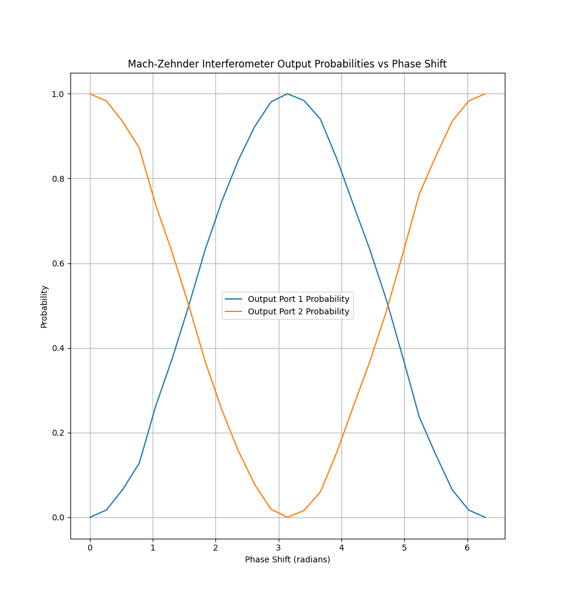

# Photon Weave Usage Examples

## Mach-Zehnder Interferometer
[mach_zehnder_interferometer.py](./mach_zehnder_interferometer.py)

This example demonstrates the simulation of a Mach-Zehnder Interferometer (MZI), a key optical component used in quantum computing and photonics research. The MZI splits an input photon beam into two paths, introduces phase shifts, and then recombines the paths to produce interference patterns.

The diagram below illustrates the simulated output from the Mach-Zehnder Interferometer:

